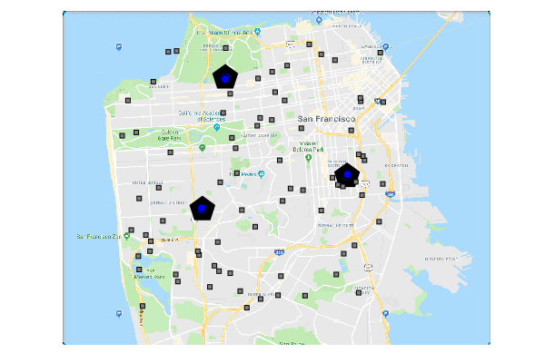
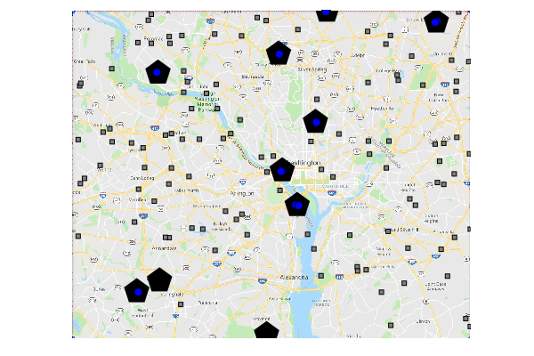

# MultiAgentAllocationTransit

Accompanying code repository for our ICRA 2020 submission 'Efficient Multi-Drone Delivery Using Transit Networks' ([arXiv](https://arxiv.org/abs/1909.11840)).
In this paper, we present a comprehensive algorithmic framework to operate a large fleet of drones to deliver
packages in an urban area while using transit networks to enhance their effective range. Please see the extended
version on ArXiv for the formulation, algorithms, experiments, and discussions.

### Illustrations

Below is a visualized scenario with 80 agents in San Francisco,
using the bus network and other parameters as described in the paper.
The black pentagons are depots, the grey rectangles are delivery
locations, blue circles are drones flying, and red circles are drones riding on transit. We
do not render the actual transit vehicles (buses) for clarity. Multiple drones may use a transit option
simultaneously; we can only render one red circle in that case.
_Locations are randomly generated within a bounding
box, and some of them may be slightly offshore_.



Here is another example, with 110 agents, in the Washington DC Metropolitan Area:




## Setup and Notebook

**Note** - Documentation in progress.
For those of you familiar with the Julia package manager, I provide a `Manifest.toml` because there are two custom dependencies: my fork of [Graphs.jl](https://github.com/Shushman/Graphs.jl) (which has various extensions to A*
with an implicit graph representation) and my [MultiAgentPathFinding.jl](https://github.com/Shushman/MultiAgentPathFinding.jl),
which implements Enhanced CBS. You can also just `add` those repos directly and then `dev` this one, instead of
instantiating the environment.
Also, there are several moving parts to the code, and the two main units, graph search and multi-agent path finding have been tested themselves.
Thus, I've been a bit lazy with testing here, but I might add some basic integration tests later.

The `MultiAgentAllocationTransit` repository is set up as a package with its own environment in [Julia 1.0](https://julialang.org/downloads/). Look at **Using someone else's project** at the Julia [package manager documentation](https://julialang.github.io/Pkg.jl/v1/environments/#Using-someone-else's-project-1) for the basic idea. To get the code up and running (after having installed Julia), first `cd` into the `MultiAgentAllocationTransit` folder.
Then start the Julia REPL and go into [package manager](https://julialang.github.io/Pkg.jl/v1/getting-started/) mode by pressing `]`, followed by:
```shell
(v1.0) pkg> activate .
(MultiAgentAllocationTransit) pkg> instantiate
```
This will install the necessary dependencies and essentially reproduce the Julia environment required to make the package work. You can test this by exiting the package manager mode with the backspace key and then in the Julia REPL entering:
```shell
julia> using MultiAgentAllocationTransit
```
The full package should then pre-compile. AFTER this step, you can start [IJulia](https://github.com/JuliaLang/IJulia.jl) (install it if you have not already) and open up the root folder:
```shell
julia> using IJulia
julia> notebook(dir="./")
```
You can then run the `multi-drone-routing-example` notebook to get an idea of how to use the code for a specific domain. An overview of the code package itself is given below, after the illustrations.


### Code Overview

I've given a brief overview of the code in the `src/` folder, and an even more brief outline of the `scripts/` folder. Some of the important structs and methods in the various files have additional comments. The `multi-drone-routing-example` notebook is a good illustration of how the code is actually used.

- `src/gtfs_parser.jl`: Various utilities for converting the GTFS files for the transit networks into a form usable by me
- `src/load_transit_env.jl`: A handful of utilities for loading up the operation graph from the parsed GTFS files
- `src/preprocessing.jl`: Implements the functions for the two main preprocessing steps - computing the surrogate travel time estimate and the admissible heuristic on the flight distance
- `src/task_allocation.jl`: Implements the _MergeSplitTours_ algorithm for the delivery sequence allocation layer.
- `src/mapf_transit.jl`: Implements everything necessary to use the Enhanced CBS Solver from [MultiAgentPathFinding.jl](https://github.com/Shushman/MultiAgentPathFinding.jl) for the MAPF-TN layer.
- `scripts/test_*.jl`: Hacked scripts for playing around. Ignore.
- `scripts/benchmark_*.jl`: The various scripts used for the results in the paper. The benchmarks should be reproducible if you parse the GTFS files (not uploaded) to the corresponding JSON files, run `preprocess_travel_time_estimates.jl` to save the surrogate object that is the loaded by the benchmark scripts, and use the same `MersenneTwister` as mentioned in the script. The separate `benchmark_mult_agents_light.jl` script uses the direct flight time as the surrogate instead of the preprocessed estimate (this could have been an argument to `benchmark_multi_agents.jl`, but I got lazy).

**Note on Reproducibility**
</br>
The allocation and replanning benchmarks should be straightforward to reproduce.
The one caveat is that for settings with l/m = 10, the trials would take very long much more often. Therefore, I reduced the `env.threshold_global_conflicts`
from 10 to 5 while running benchmarks (the solver throws an exception after 5 high-level conflicts). At some point, I'll take a deeper dive into handling many high-level conflicts better, or just have more functionality for terminating easily.
</br>
In general, it is very important to me that anyone re-running this be able to reproduce numbers/results. Please email me at shushmanchoudhury@gmail.com if you have any issues or need any help.
